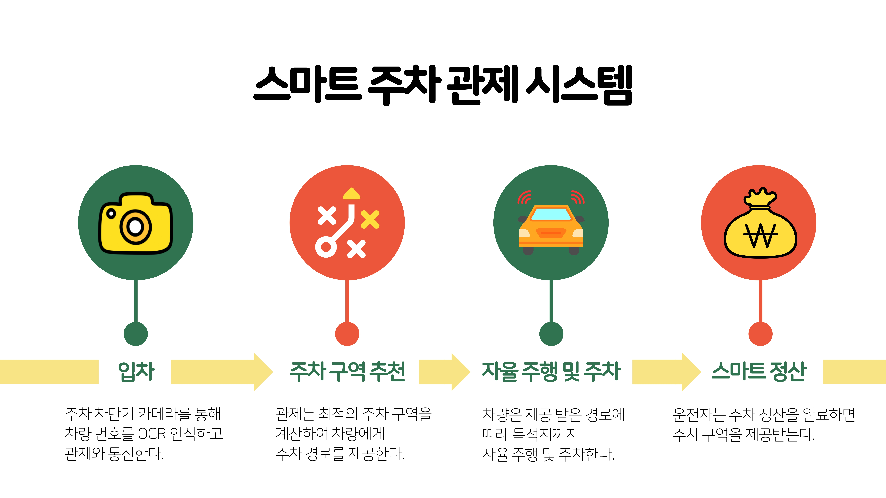
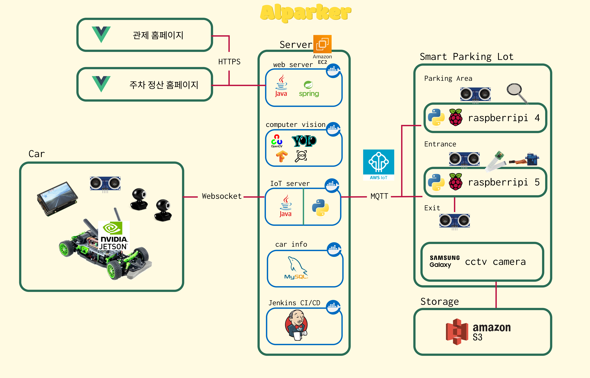
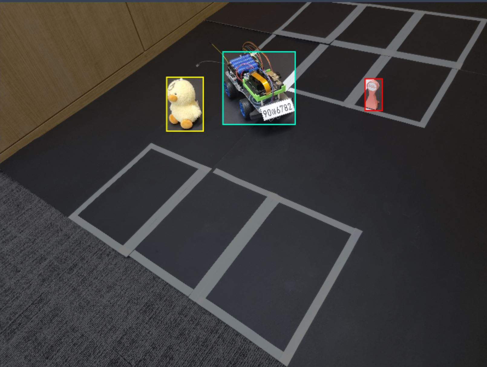
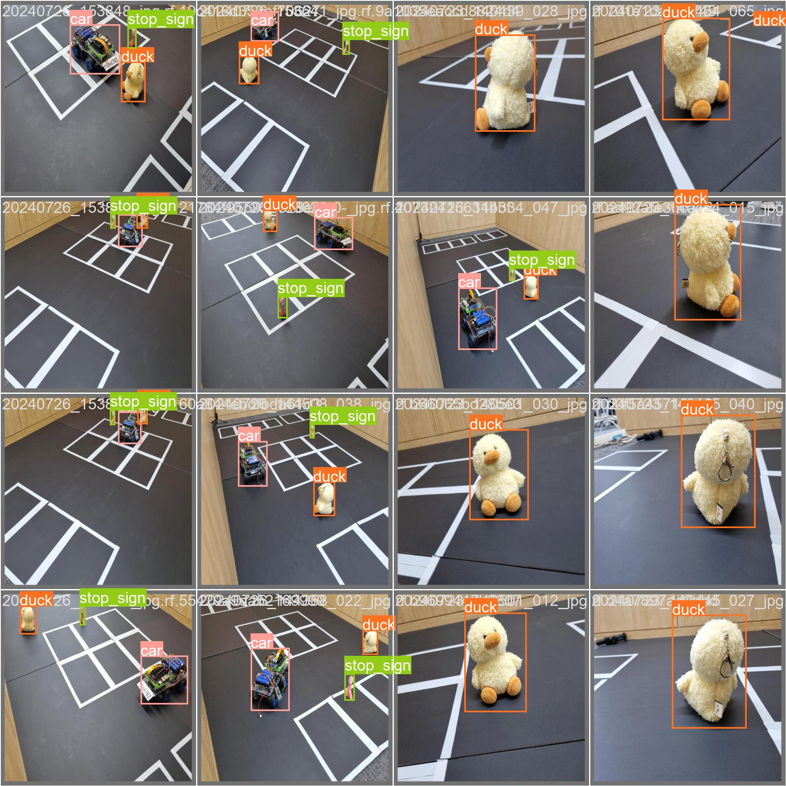
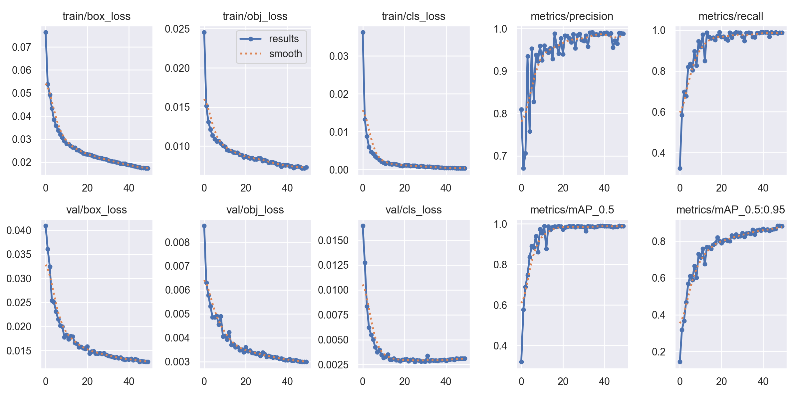
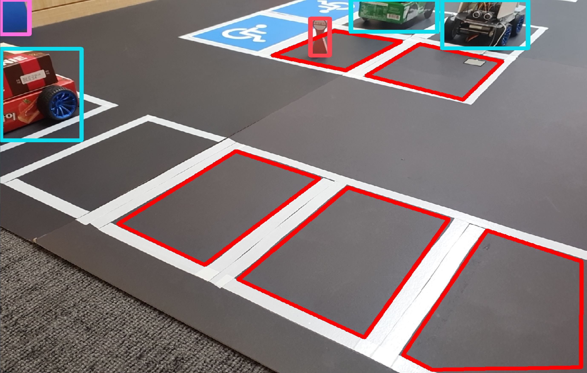
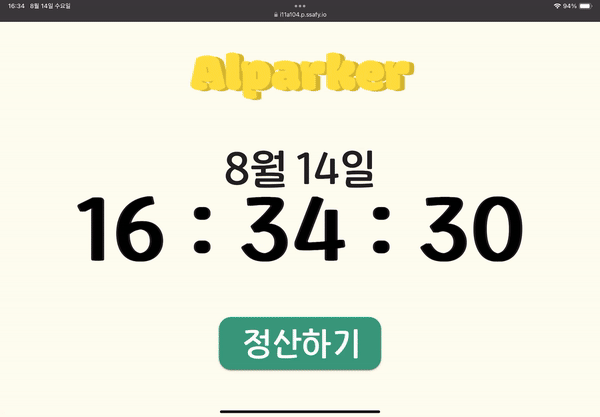
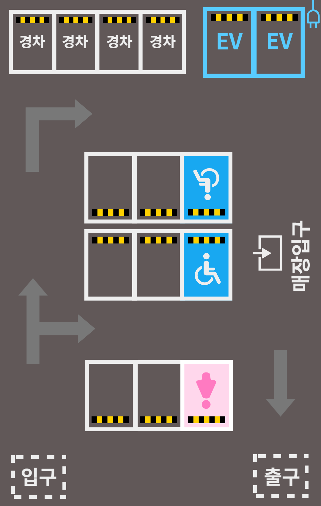
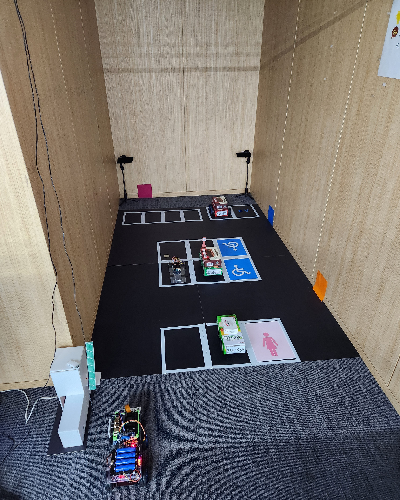

# AIPARKER

입차 부터 출차까지 **한번에!**
온디바이스 AI 기반 주차장 관제 서비스 **AIParker**
### [UCC 링크](https://youtu.be/tx1e9MazhyM)

 

## AIPARKER 소개

AIPARKER는 온디바이스 AI를 활용한 주차장 관제 시스템입니다.

 

## 시스템 아키텍처

 

## 주요 기능
### 관제
- 인프라
    - AWS EC2 환경에 서버 배포
    - AWS S3 스토리지에 CCTV 사진, 번호판 사진 업로드
    - AWS IoT를 이용하여 MQTT 통신 구현
    - Jenkins 를 이용한 CI/CD 환경 구축
    - Docker Hub에 Docker image 업로드

- 서버
    - 웹서버 (JAVA)
        - 관제 페이지 및 정산 페이지 API

    - 컴퓨터 비전 서버 (python)
        - 현재 주차장 상태를 확인하여 업데이트 (feat. 비전 모델, 압센서)

    - 주차 관제 서버 (JAVA)
        - 차량이 들어오면 주차 하기 가장 편한 위치를 선정하여 차량을 배정
        - 차량이 주차 구역까지 최적으로 이동하는 경로 검색
        - 차량과 websocket 통신으로 최적 주차 구역까지의 경로를 전달

    - IoT 서버 (python)
        - 주차장 차단기와 압센서와 MQTT 통신으로 소통

 
 

### IoT
- 주차장 차단기
    
    - 차량이 들어오면 초음파 센서로 진입을 감지, 카메라로 번호판을 촬영하여 S3에 저장
    -  mqtt 통신을 통해 ec2에 요청을 보내면, Google OCR API를 이용하여 OCR 실시 후 차량 정보 데이터베이스에 저장
    - 정보가 올바르게 저장되면 차단기 개방

- 주차 유휴면 판별기  (feat. 압센서)
    - 압력 센서/ 초음파 센서 기반 빈 주차 구역인지 판단
    - 압력 센서 값과 초음파 센서 값이 모두 특정 threshold를 넘을 경우 주차 구역에 차량이 주차 되어 있다고 판단
    - 판단 결과를 MQTT 통신으로 서버에 전달

  
 

### 차량

- 출발 기능
    - 카메라 객체 인식을 통해 차단기가 올라간 것을 확인
    - websocket 통신을 통해 관제 서버로부터 최적 주차 구역/경로 요청 및 수신

- 장애물(오리) 감지 기능
    - 카메라를 통해 오리가 객체 인식되는지 확인
    - 초음파를 통해 객체 인식된 오리와의 거리를 인식
    - 30cm 이내가 될 때까지 주행, 30cm 이내가 되면 차량 정지
    - 오리가 사라지면 3번 확인한 후 다시 주행
    

- 자율주차 기능
    - 초음파와 카메라를 통해 차량 위치를 확인하며 주차 수행
    

  
 

### 영상 처리
- YOLO v5 학습
    - Roboflow 사이트를 이용하여 객체 라벨링 진행
    
    - yolo v5 모델을 이용하여 학습
    
    
- 빈 주차 구역 판별
    - 주차 구역을 마킹하여 주차 영역을 좌표로 저장
    - 학습한 yolo v5 모델을 사용하여 자동차와 주차 금지 표시판 객체 인식
    - 주차 구역과 객체의 bounding box의 겹치는 영역을 계산하여 75%가 넘을 경우 주차가 불가능하다고 판별
    

  
 

### 웹 페이지
- 메인 페이지
    - 현재 시간을 실시간으로 보여준다.

- 차량 번호 입력 페이지
    - 차량 번호를 입력한다.
    - 번호 네 자리를 모두 입력하지 않거나 조회되지 않는 번호를 입력하였을 경우 경고창이 나온다.

- 차량 선택 페이지
    - 조회한 차량을 차단기에서 촬영한 사진과 함께 보여준다.
    - 조회 차량이 3대 이상일 경우 캐러셀 형태로 보여준다.

- 차량 조회 페이지
    - 차량번호, 입차 시각, 주차 시간, 주차 구역, 결제 금액을 보여준다.
    - 결제 금액은 10분에 500원으로 측정한다.

- 결제 페이지
    - 결제는 신용카드, 간편 결제, 현금 결제로 가능하다.
    - 결제 시 5초 후 정산 완료 페이지로 넘어간다.

- 정산 완료 페이지
    - 정산 완료와 함께 주차 구역을 보여준다.
    

 

## 주차장 설계도

  
  

 

## 멤버 소개
|제목|내용|내용|
|-----|-----|-----|
|팀장|신우호|영상처리|
|팀원|임광영|영상처리|
|팀원|박경령|차량|
|팀원|배윤재|차량|
|팀원|이가은|관제|
|팀원|이진희|관제|

