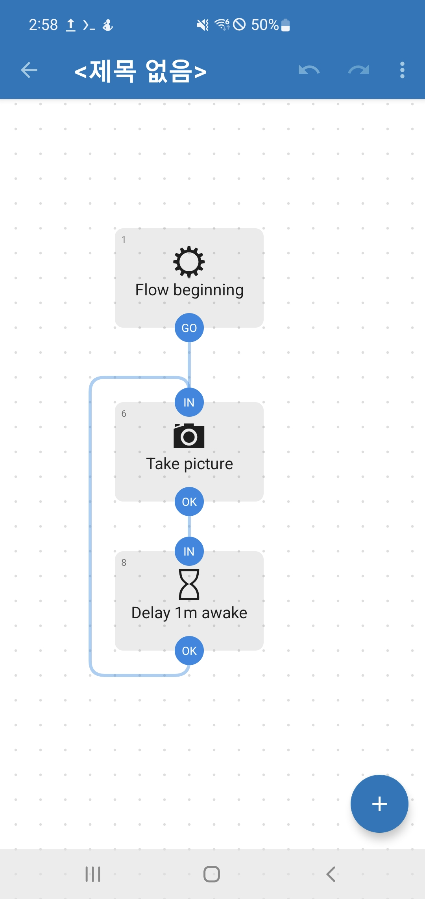
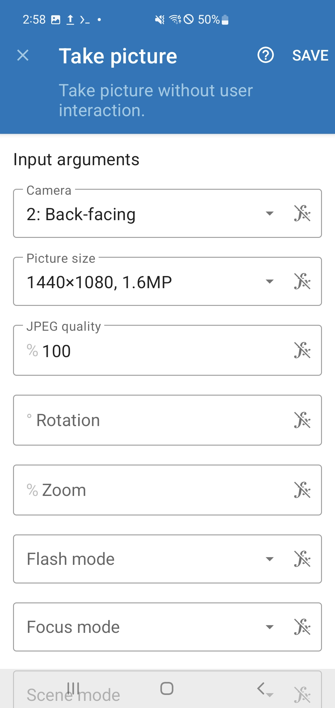
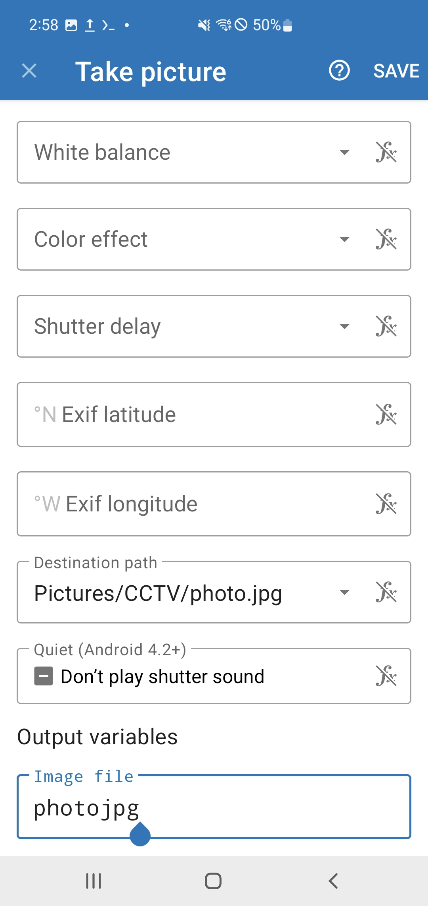
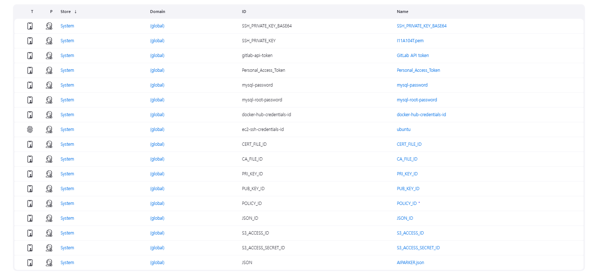

# 1. 사용한 IDE

- VS code (Vue.js 및 라즈베리파이 개발(ssh))
- Intellij (Java 개발)
- Pycharm (Python 개발)

+) 패키지 설치 관련 버전 정보는 깃랩 소스 코드에 포함

# 2. 사용한 외부 하드웨어

- Jetson Orin Nano (자율 주행 차량)
    - vehicle 폴더에 있는 소스 파일 실행
    - 초음파 센서, 카메라, 모터 연결 필요
- raspberrypi 5 (주차장 차단기)
    - barrier 폴더에 있는 소스 파일 실행
    - 초음파 센서, 카메라, 서보 모터 연결 필요
- raspberrypi 4 (주차 구역 판별용 압센서) with 초음파 센서, 압센서
    - 폴더에 있는 소스 파일 실행
    - 초음파 센서, 압센서 연결 필요

# 3. 사용한 외부 서비스

### 도커 허브 (도커 파일 업로드 용)

- 도커 허브 가입 ⇒ 유저네임, 패스워드 필요

### AWS

- AWS EC2 (서버 배포): ssafy 제공
    - ssh 접근을 위한 pem 키가 필요합니다.
    
- AWS IoT (mqtt 통신용)
    - 사물을 생성하고 새로운 인증서를 생성합니다.
    - cert 파일에 인증 키를 저장해야 합니다.
        - 디바이스 인증서 → device.pem.crt
        - 루트 CA 인증서(RSA) → Amazon-root-CA-1.pem
        - 프라이빗 키 → private.pem.key
    - 필요에 따라 ec2에 저장해서 볼륨 마운트 하여 사용하거나
    젠킨스 credential로 관리해서 보안을 지켜줍니다.

- AWS S3 (CCTV 사진 저장, 차량 번호판 사진 저장)
    - 버킷 생성 (버킷 이름: 고유한 값으로)
        
        AWS region : ap-northeast-2
        
    - IAM(**Identity and Access Management) 설정**
        
        새로 하나 만들고 액세스 키를 저장합니다.
        
        권한에 S3 access 추가
        

### Termux & Automate (스마트폰 CCTV 구축)

스마트폰에 앱을 설치합니다.

- Termux 설정

```bash
pkg update && pkg upgrade
pkg install termux-api
pkg install cronie
```

```bash
termux-setup-storage
// 권한 허용하기
// 해당 권한을 허용하면 storage폴더가 생기는데 그 폴더로 휴대폰의 사진에 접근할 수 있다.
```

```bash
pkg install python
pip install awscli
aws configure
```

upload.sh

```bash
#!/bin/bash
# Define variables
BUCKET_NAME=""
PHOTO_PATH="/data/data/com.termux/files/home/storage/pictures/CCTV/photo.jpg"
TIMESTAMP=$(date +%Y%m%d%H%M%S)
CCTV_NUM=1
UPLOAD_PATH="images/$CCTV_NUM/$TIMESTAMP.jpg"

# Take a photo
# termux-camera-photo -c 0 $PHOTO_PATH
# 현재 Termux api 권한 문제로 카메라 사용 불가 -> automate로 대체

# Upload the photo to S3
aws s3 cp $PHOTO_PATH s3://$BUCKET_NAME/$UPLOAD_PATH
echo "Photo uploaded to s3://$BUCKET_NAME/$UPLOAD_PATH"
```

```bash
chmod +x upload.sh
```

**crontab 설정하기 → 1분마다 사진 업로드**

crontab -e

```bash
* * * * * /data/data/com.termux/files/home/upload.sh
```

크론 데몬 시작 **`crond`**

+) 크론 작업 중지 **`pkill crond`**

- Automate 설정

<p align="center">
  
  
  
</p>

# 4.  CI/CD

젠킨스 사용

- 젠킨스는 ssafy에서 제공받은 ec2에 깔아서 작업했습니다.
- 젠킨스는 도커로 설치했습니다.

젠킨스가 도커로 깔려 있어 도커 내부에서 도커를 접속할 일이 생깁니다.

+) 도커 아웃 도커 (Docker outside of Docker, DooD)

- 도커 아웃 도커는 컨테이너 내부에서 도커 클라이언트를 사용하여 호스트의 도커 데몬에 접근하는 방식입니다.
- 주로 도커 소켓(`/var/run/docker.sock`)을 컨테이너에 마운트하여 사용합니다.

아래 명령어로 젠킨스 다시 키기

```bash
# DoD
sudo docker run -d --name jenkins -p 8080:8080 -v /home/ubuntu/jenkins-data:/var/jenkins_home -v /var/run/docker.sock:/var/run/docker.sock jenkins/jenkins:lts
```

젠킨스 bash로 들어갔을 때 

docker —version, docker-compose —version 이 작동해야합니다.

- 젠킨스 파이프라인

```sql
pipeline {
    agent any
    
    environment {
        DOCKER_USERNAME = 'dockerusername'
        MYSQL_DOCKER_URL = 'jdbc:mysql://mysql:3306/aiparker?allowPublicKeyRetrieval=true&useSSL=false&serverTimezone=Asia/Seoul&characterEncoding=UTF-8'
        MYSQL_DOCKER_USERNAME = 'A104'
        MYSQL_DOCKER_PW = credentials('mysql-password')
        MYSQL_ROOT_PW = credentials('mysql-root-password')
        EC2_USER = 'ubuntu'
        EC2_HOST = 'i11a104.p.ssafy.io'
        EC2_KEYFILE = credentials('SSH_PRIVATE_KEY')
        END_POINT = "aws-iot-endpoint"
        CERT_FILE = credentials('CERT_FILE_ID')
        CA_FILE = credentials('CA_FILE_ID')
        PRI_KEY_FILE = credentials('PRI_KEY_ID')
        PUB_KEY_FILE = credentials('PUB_KEY_ID')
        POLICY = credentials('POLICY_ID')
        JSON = credentials('JSON_ID')
        S3_ACCESS = credentials('S3_ACCESS_ID')
        S3_ACCESS_SECRET = credentials('S3_ACCESS_SECRET_ID')
    }

    stages {
        stage('Checkout') {
            steps {
                // GitLab 저장소에서 소스 코드를 클론
                git branch: 'master', url: 'https://lab.ssafy.com/s11-webmobile3-sub2/S11P12A104', credentialsId: 'Personal_Access_Token'
            }
        }
        
        stage('Gradle Build') {
            steps {
                script {
                    // Docker 컨테이너 내에서 실행
                    docker.image('gradle:7.3.3-jdk17').inside {
                        dir('server/web_server') {
                            sh 'chmod +x gradlew'
                            sh './gradlew build -x test'
                        }
                    }
                }
            }
            post {
                always {
                    archiveArtifacts artifacts: 'server/web_server/build/libs/*.jar', allowEmptyArchive: true
                }
            }
        }
        
        stage('Prepare Certs') {
            steps {
                sh '''
                mkdir -p server/iot_server/cert
                echo "${CERT_FILE}" > server/iot_server/cert/A104.cert.pem
                echo "${CA_FILE}" > server/iot_server/cert/root-CA.crt
                echo "${PRI_KEY_FILE}" > server/iot_server/cert/A104.private.key
                echo "${PUB_KEY_FILE}" > server/iot_server/cert/A104.public.key
                echo "${POLICY}" > server/iot_server/cert/A104-Policy
                echo "${S3_ACCESS}" > server/iot_server/cert/aws_access_key_id.txt
                echo "${S3_ACCESS_SECRET}" > server/iot_server/cert/aws_secret_access_key.txt
                
                mkdir -p vision/parking/cert
                echo "${CERT_FILE}" > vision/parking/cert/A104.cert.pem
                echo "${CA_FILE}" > vision/parking/cert/root-CA.crt
                echo "${PRI_KEY_FILE}" > vision/parking/cert/A104.private.key
                echo "${PUB_KEY_FILE}" > vision/parking/cert/A104.public.key
                echo "${POLICY}" > vision/parking/cert/A104-Policy
                echo "${S3_ACCESS}" > vision/parking/cert/aws_access_key_id.txt
                echo "${S3_ACCESS_SECRET}" > vision/parking/cert/aws_secret_access_key.txt
                '''
            }
        }
        
        stage('Copy JSON Credential') {
            steps {
                script {
                    // withCredentials 블록을 사용하여 Credential 파일을 특정 경로에 복사
                    withCredentials([file(credentialsId: 'JSON', variable: 'JSON_FILE')]) {
                        // 타겟 경로에 디렉토리가 없으면 생성
                        sh "mkdir -p server/iot_server/cert"
                        // Credential 파일을 특정 경로로 복사
                        sh "cp $JSON_FILE server/iot_server/cert/AIPARKER.json"
                    }
                }
            }
        }
        
        stage('Build Docker Images') {
            steps {
                script {
                    sh 'docker-compose -f docker-compose.yml build'
                }
            }
        }
        
        stage('Push Docker Images to Docker Hub') {
            steps {
                script {
                    docker.withRegistry('https://index.docker.io/v1/', 'docker-hub-credentials-id') {
                        sh 'docker-compose -f docker-compose.yml push'
                    }
                }
            }
        }
        
        stage('Modify and Copy Compose File to EC2') {
            steps {
                script {
                    // Docker Compose 파일에서 'build' 부분 제거
                    sh """
                    sed -e '/^[[:space:]]*build:/d' -e '/^[[:space:]]*context:/d' docker-compose.yml > docker-compose-modified.yml
                    """

                    // 수정된 Docker Compose 파일을 EC2 인스턴스로 전송
                    sh 'scp -o StrictHostKeyChecking=no -i ${EC2_KEYFILE} docker-compose-modified.yml ${EC2_USER}@${EC2_HOST}:/home/ubuntu/deploy/docker-compose.yml'
                }
            }
        }
        
        stage('Deploy to EC2') {
            steps {
                script {
                    sshagent(credentials: ['ec2-ssh-credentials-id']) {
                        sh """
                        ssh -o StrictHostKeyChecking=no -i $EC2_KEYFILE $EC2_USER@$EC2_HOST '
                          cd /home/ubuntu/deploy &&
                          echo "DOCKER_USERNAME=$DOCKER_USERNAME" > .env &&
                          echo "MYSQL_DOCKER_URL=$MYSQL_DOCKER_URL" >> .env &&
                          echo "MYSQL_DOCKER_USERNAME=$MYSQL_DOCKER_USERNAME" >> .env &&
                          echo "MYSQL_DOCKER_PW=$MYSQL_DOCKER_PW" >> .env &&
                          echo "MYSQL_ROOT_PW=$MYSQL_ROOT_PW" >> .env &&
                          echo "END_POINT=$END_POINT" >> .env &&
                          echo "CERT_FILE_PATH=/app/cert/A104.cert.pem" >> .env &&
                          echo "CA_FILE_PATH=/app/cert/root-CA.crt" >> .env &&
                          echo "PRI_KEY_FILE_PATH=/app/cert/A104.private.key" >> .env &&
                          echo "MYSQL_USER=$MYSQL_DOCKER_URL" >> .env &&
                          echo "MYSQL_PASSWORD=$MYSQL_DOCKER_PW" >> .env &&
                          echo "MYSQL_HOST=mysql" >> .env &&
                          echo "MYSQL_DATABASE=aiparker" >> .env &&
                          echo "S3_ACCESS=${S3_ACCESS}" >> .env &&
                          echo "S3_ACCESS_SECRET=${S3_ACCESS_SECRET}" >> .env &&
                          
                          sudo docker-compose down &&
                          sudo docker-compose pull &&
                          sudo docker-compose up -d
                        '
                        """
                    }
                }
            }
        }

    }

    post {
        success {
            echo 'Build and Deploy succeeded!'
        }
        failure {
            echo 'Build or Deploy failed.'
        }
    }
}

```

젠킨스 Credential

- 발급받은 키를 저장해둡니다.



+) 모든 환경 변수는 젠킨스에서 관리하도록 설계하였습니다.